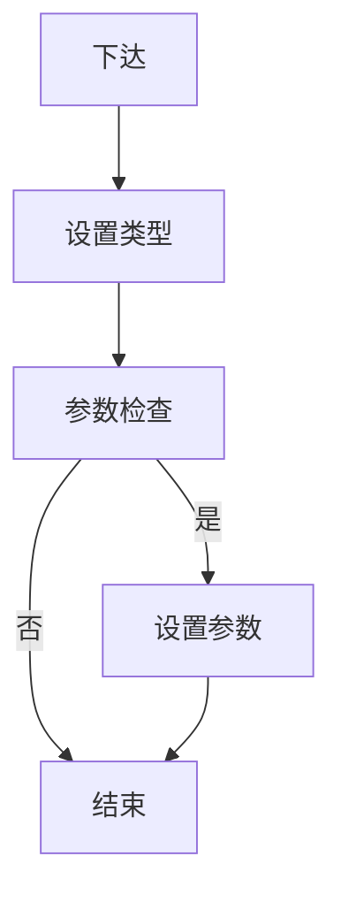

# FlowChart
## 指令下达
- 点击下达
- 设置请求类型-STR_PB_CREATE_INST_ONECODE
- 参数判断-产品名称或单元名称是否为空
- 发送业务请求-SetData

```mermaid
  graph TD;
      A[下达]-->B[设置类型];
      B[设置类型]-->参数检查;
      参数检查--否-->结束;
      参数检查--是-->设置参数;
      设置参数-->结束
```
